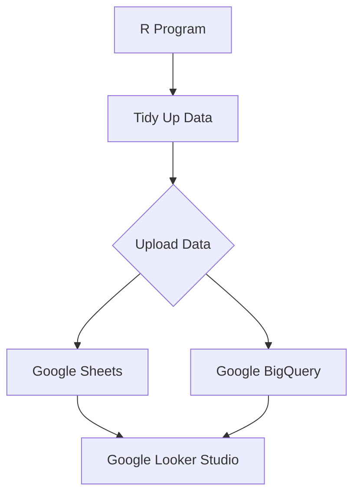

# Data Visualization Ecosystem

We are going to use R program to tidy up data then upload data to either Google Sheets or Google BigQuery, then connect data to Google Looker Studio.

Google Looker Studio can be accessed at:

- [Google Looker Studio](https://lookerstudio.google.com)

Google BigQuery can be accessed through Google Cloud Platform at

- [Google Cloud Platform](https://console.cloud.google.com/)