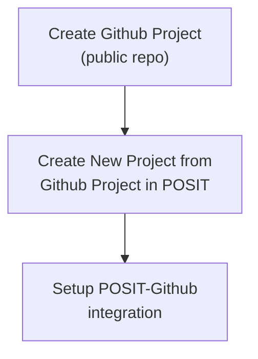
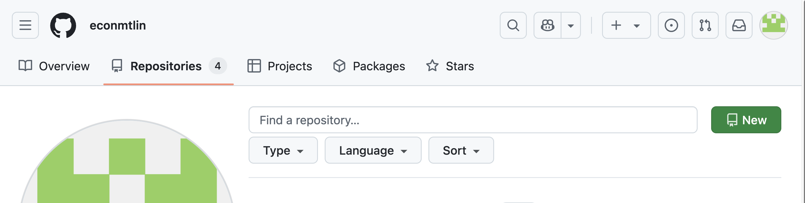
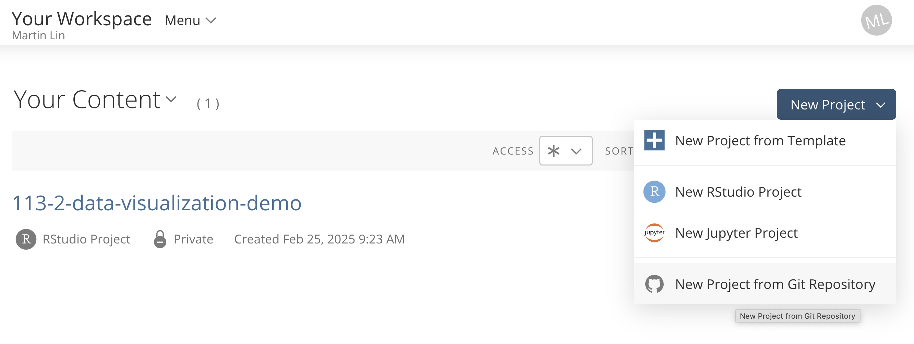
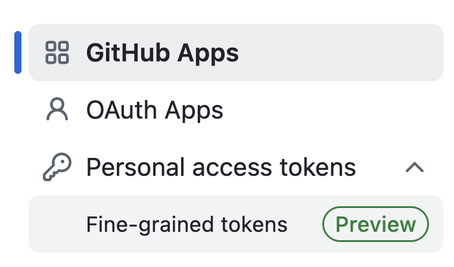
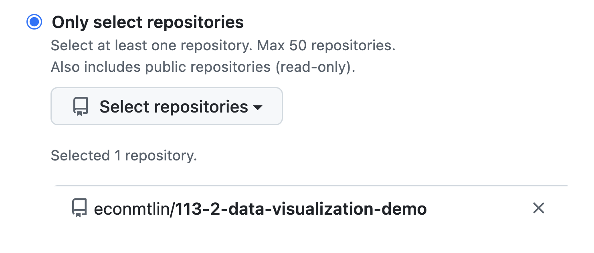
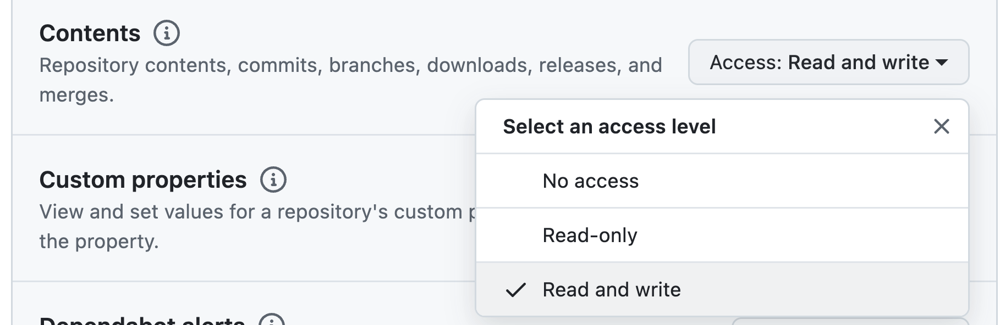

# Github and POSIT

## Table of Contents

- [Github and POSIT](#github-and-posit)
  - [Table of Contents](#table-of-contents)
  - [Introduction](#introduction)
  - [Create Github Project](#create-github-project)
  - [Create New Project from Github Project in POSIT](#create-new-project-from-github-project-in-posit)
  - [Setup POSIT-Github integration](#setup-posit-github-integration)
    - [1. Set up for Git](#1-set-up-for-git)
    - [2. Create personal access token](#2-create-personal-access-token)
    - [3. Save the token in POSIT](#3-save-the-token-in-posit)

## Introduction

Github:  
  - store your files
  - Copilot discussion those files  

> Coplilot is like ChatGPT, but it is more focusing on code.

POSIT:  
  - Run codes

Create Github Project (public repo)

Create New Project from Github Project in POSIT

Setup POSIT-Github integration




## Create Github Project



  - Click "New" button  

> :exclamation: Make sure it is a "Public" repository.

## Create New Project from Github Project in POSIT



## Setup POSIT-Github integration

 1. [Set up for Git](#1-set-up-for-git)
 2. [Create personal access token](#2-create-personal-access-token)
 3. [Save the token in POSIT](#3-save-the-token-in-posit)

### 1. Set up for Git

Run
```
file.edit(".Rprofile")
```

And paste the following code and save it:

```r
# Set your email and name for Git
email <- "你的github電子郵件"
name <- "你的github用戶名"

# Run the git config commands
system2("git", args = c("config", "--global", "user.email", email))
system2("git", args = c("config", "--global", "user.name", name))
```

### 2. Create personal access token

Token is a password that has limited access to your account.

  - Go to Github and click on your profile picture.
  - Click on "Settings".
  - Click on "Developer settings".
  - Click on "Personal access tokens".
  - Click on "Fine-grain access token"



***

Make sure you select only the repo you want the token to access.


*** 
Make sure set up the token permissions correctly.



### 3. Save the token in POSIT

Run
```
file.edit("toke")
```

And paste the token in the file and save it.

:exclamation::exclamation::exclamation:Click `.gitignore` and add `toke` to the file. <span style="color:red">very important</span>

Now you can restart your POSIT to make the integration work.
