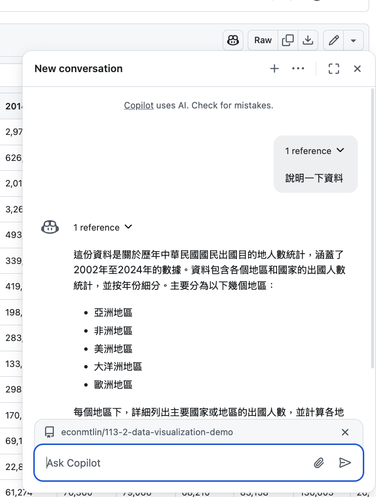

# Github Copilot and POSIT

Create Github Project (public repo)

Create New Project from Github Project in POSIT

Then

<https://github.com/copilot/share/0a181116-03c4-8c84-b841-aa01206f0867>

## Debug

  - If there is an error message, feed it back to the AI.  
  - If the result is not what you expected, ask AI to explain the code that generate the result.
  
