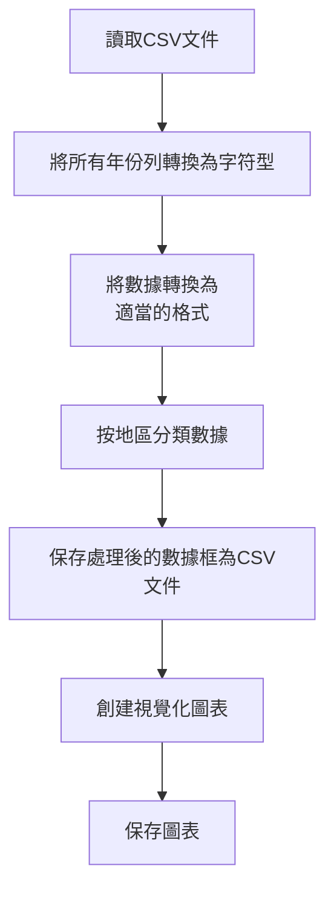

# Environment setup

## tidyverse 

**tidyverse** is a collection of R packages designed for data science. It includes packages like `ggplot2`, `dplyr`, `tidyr`, `readr`, etc. 

## Chinese characters

```
if (!requireNamespace("showtext", quietly = TRUE)) {
  install.packages("showtext")
}
if (!requireNamespace("sysfonts", quietly = TRUE)) {
  install.packages("sysfonts")
}

library(showtext)
library(sysfonts)

sysfonts::font_add_google('Noto Sans TC')
showtext_auto()

theme_set(
  theme(
    text = element_text(family = "Noto Sans TC")
  ) + 
  theme_classic()
)
```

# Talk with Data

## Github Copilot


[歷年中華民國國民出國目的地人數統計](https://data.gov.tw/dataset/7325)

## Flow chart




## State mining direction

> 想計算不同"首站抵達地"的各年度總人數並以適當圖形呈現。

  - Vague direction


> `myData` 是 歷年中華民國國民出國目的地人數統計，其data frame內容如下：
```
Rows: 6
Columns: 23
$ 首站抵達地 <chr> "亞洲地區", "亞洲地區", "亞洲地區", "亞洲地區", "亞洲地區", "亞洲地區"
$ 細分       <chr> "日本Japan", "韓國Korea", "香港Hong Kong", "中國大陸China", "澳門Macao", "越南Vietnam"
$ `2002`     <chr> "797,460", "120,208", "2,418,872", "-", "1,269,840", "225,733"
$ `2003`     <chr> "731,330", "179,893", "1,869,069", "-", "837,936", "222,487"
$ `2004`     <chr> "1,051,954", "298,325", "2,559,705", "-", "1,038,006", "266,115"
$ `2005`     <chr> "1,180,406", "368,206", "2,807,027", "-", "1,163,822", "234,009"
$ `2006`     <chr> "1,214,058", "396,705", "2,993,317", "-", "1,232,232", "242,852"
$ `2007`     <chr> "1,280,853", "457,095", "3,030,971", "-", "1,196,110", "272,020"
$ `2008`     <dbl> 1309847, 363122, 2851170, 188744, 926593, 285263
$ `2009`     <dbl> 1113857, 388806, 2261001, 1516087, 739263, 264819
$ `2010`     <dbl> 1377957, 406290, 2308633, 2424242, 667910, 313987
$ `2011`     <dbl> 1136394, 423266, 2156760, 2846572, 587633, 318587
$ `2012`     <dbl> 1560300, 532729, 2021212, 3139055, 527050, 341511
$ `2013`     <dbl> 2346007, 518528, 2038732, 3072327, 514701, 361957
$ `2014`     <dbl> 2971846, 626694, 2018129, 3267238, 493188, 339107
$ `2015`     <dbl> 3797879, 500100, 2008153, 3403920, 527144, 409013
$ `2016`     <dbl> 4295240, 808420, 1902647, 3685477, 598850, 465944
$ `2017`     <dbl> 4615873, 888526, 1773252, 3928352, 589147, 564002
$ `2018`     <dbl> 4825948, 1086516, 1696265, 4172704, 605468, 659123
$ `2019`     <dbl> 4911681, 1209062, 1676374, 4043686, 596721, 853257
$ `2020`     <dbl> 697981, 163953, 158008, 414634, 54537, 158286
$ `2021`     <dbl> 14049, 8269, 12692, 128637, 11468, 11123
$ `2022`     <dbl> 354219, 78318, 52725, 165895, 7556, 133203
```
> 想計算不同"首站抵達地"的各年度總人數並以適當圖形呈現。

```diff
- 為確保任務的連續性，最好提到所關注物件在環境裡的名稱。
- provide context to make your direction clear.
```

### Program

```{r}
library(tidyverse)

# 將數據中的所有年度列轉換為字符型，避免類型不一致的問題
myData_clean <- myData %>%
  mutate(across(starts_with("20"), as.character))  # 將所有以 "20" 開頭的列轉換為字符型

# 轉換為長格式
myData_long <- myData_clean %>%
  pivot_longer(cols = starts_with("20"),  # 轉長格式，選擇所有以20開頭的列
               names_to = "年度", 
               values_to = "人數") %>%
  mutate(人數 = str_replace_all(人數, ",", ""),  # 移除千位符
         人數 = as.numeric(ifelse(人數 == "-", NA, 人數)))  # 將 "-" 轉為 NA，並轉為 numeric

# 移除細分中出現 "合計" 的資料
myData_long_filtered <- myData_long %>%
  filter(!str_detect(細分, "合計"))  # 過濾掉包含 "合計" 的行

# 計算各年度對應的總人數
總人數_by_country <- myData_long_filtered %>%
  group_by(首站抵達地, 年度) %>%
  summarise(總人數 = sum(人數, na.rm = TRUE), .groups = 'drop')  # 計算總人數並移除分組

# 繪製圖形
ggplot(總人數_by_country, aes(x = 年度, y = 總人數, color = 首站抵達地)) +
  geom_line() +
  geom_point() +
  labs(title = "不同首站抵達地的年度總人數",
       x = "年度",
       y = "總人數") +
  theme_minimal() +
  theme(axis.text.x = element_text(angle = 45, hjust = 1))  # 調整 x 軸標籤角度
```

> It is always good to check the data used in `ggplot` to make sure it is in the format you expect.

```{r}
glimpse(總人數_by_country)
```

```{r}
# 確保年度是數值型
總人數_by_country$年度 <- as.numeric(總人數_by_country$年度)

ggplot(總人數_by_country, aes(x = 年度, y = 總人數, color = 首站抵達地)) +
  geom_line() +
  geom_point() +
  labs(title = "不同首站抵達地的年度總人數",
       x = "年度",
       y = "總人數") +
  theme_minimal() +
  theme(axis.text.x = element_text(angle = 45, hjust = 1))  # 調整 x 軸標籤角度
```

```diff
- x軸不是連續的年份，而是字符型，則點不會連成線。
- 進入作圖前，最好glimpse一下資料，確保資料格式正確。
```


## Modify theme

You can upload an image whose design attracts you and ask for a similar theme in your graph.

```{r}
g <- 
ggplot(總人數_by_country, aes(x = 年度, y = 總人數, color = 首站抵達地)) +
  geom_line() +
  geom_point() +
  labs(title = "不同首站抵達地的年度總人數",
       x = "年度",
       y = "總人數") +
  theme_minimal() +
  theme(axis.text.x = element_text(angle = 45, hjust = 1))  # 調整 x 軸標籤角度

g + new theme...
```


## Exercise

[UberEats 資料](https://docs.google.com/spreadsheets/d/1-jX-3EK_yspYDgPIy5vwnRKHntw9-dQIpFVhLc5JcXc/edit?gid=215920315#gid=215920315)