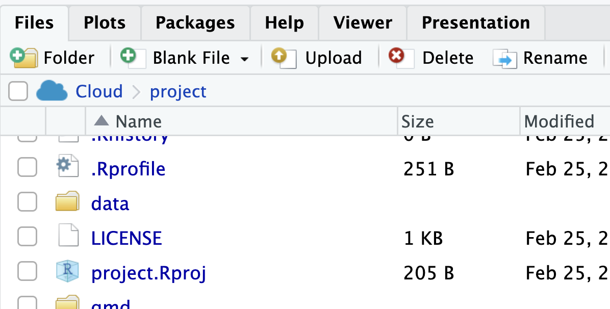
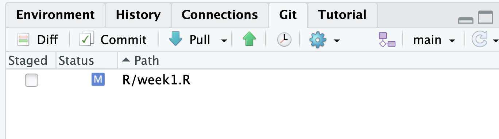
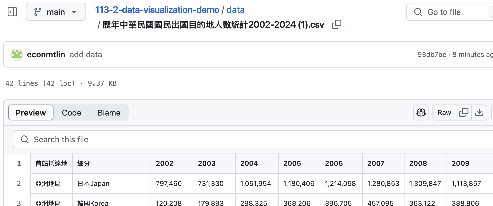
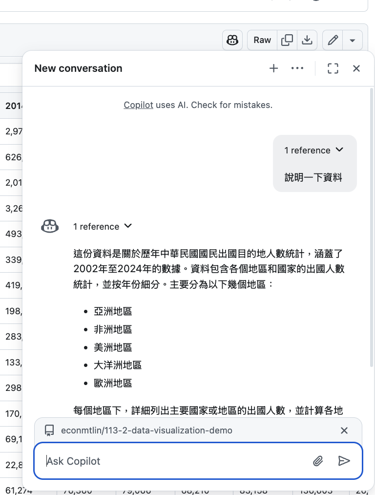
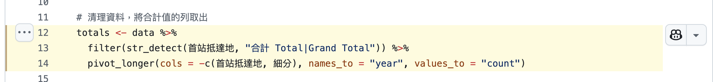

# Preliminary Data Exploration

  - Setup data analysis environment in POSIT
  - Upload data to POSIT  
  - Pull/Push files from/to Github in POSIT  
  - Use Github Copilot to explore data and generate code  

## Data Analysis Environment

Add the following code to your `.Rprofile` file:

```r
library(tidyverse)
library(showtext)
library(sysfonts)

sysfonts::font_add_google('Noto Sans TC')
showtext_auto()

theme_set(
  theme(
    text = element_text(family = "Noto Sans TC")
  ) + 
  theme_classic()
)
```

> :exclamation: There might be some packages to install. Install them. 

Then restart POSIT.

## Upload Data to POSIT

[歷年中華民國國民出國目的地人數統計](https://data.gov.tw/dataset/7325)



## Pull/Push Files from/to Github in POSIT



## Use Github Copilot to Explore Data and Generate Code

### File aware mode

Go to the file you want copilot to be aware of. 



### AI preset for code generation


## AI preset for explanation

<https://github.com/tpemartin/113-2-data-visualization/blob/7f36838f727a2a3488336f34f0feaf1cb5e955dc/Lecture-notes/AI.md?plain=1#L1>

## copilot chat


<https://github.com/copilot/share/0a181116-03c4-8c84-b841-aa01206f0867>



## Debug

  - If there is an error message, feed it back to the AI.  
  - If the result is not what you expected, ask AI to explain the code that generate the result.
  
