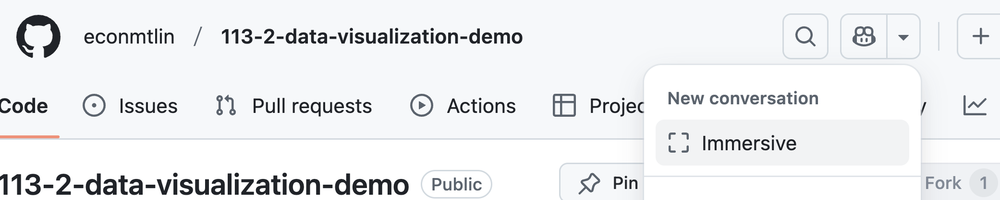

# Preliminary Data Exploration

  - Setup data analysis environment in POSIT
  - Upload data to POSIT  
  - Pull/Push files from/to Github in POSIT  
  - Use Github Copilot to explore data and generate code  

## Data Analysis Environment

Add the following code to your `.Rprofile` file:

```r
library(tidyverse)
library(showtext)
library(sysfonts)

sysfonts::font_add_google('Noto Sans TC')
showtext_auto()

theme_set(
  theme(
    text = element_text(family = "Noto Sans TC")
  ) + 
  theme_classic()
)
```

> :exclamation: There might be some packages to install. Install them. 

Then restart POSIT.

## Upload Data to POSIT

[歷年中華民國國民出國目的地人數統計](https://data.gov.tw/dataset/7325)


## Pull/Push Files from/to Github in POSIT


## Use Github Copilot to Explore Data and Generate Code

### File aware mode

Go to the file you want copilot to be aware of. 


### Immerse mode



### AI preset for code generation

#### tidyverse preset

<https://github.com/tpemartin/113-2-data-visualization/blob/main/AI-preset/preset-tidyverse.md>

#### explanation preset

When ask AI to explain code, you should design a preset to help AI to understand your background and your goal of learning.

### Debug trick

  - If there is an error message, copy and paste it back to the AI.  
  - If the result is not what you expected, ask AI to explain the code that generate the result.
  
