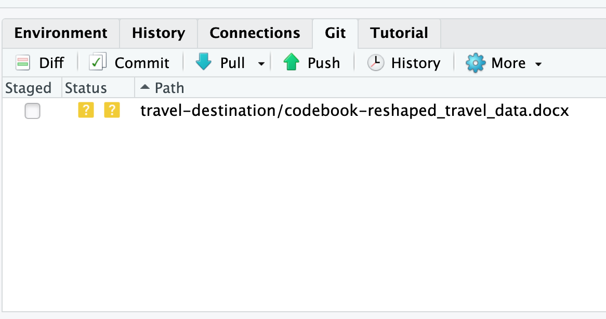

# Hello, Data! 

Let AI see your data and introduce it to you.

  - Data introduction  
  - Storytelling with data  

> Download a data from [data.gov.tw](https://data.gov.tw/).

## Choice of AI

  - Upload to ChatGPT  
  - Upload to Github

| ChatGPT | Github |
|---------|--------|
|  |  |
| | |

## Preliminary Data Tidy Process

```mermaid
graph TD
    A["`Data introduction`"] --> B{"`Will reshaping data help?`"}
    B -->|Yes| C["`Reshape data.`"]
    B -->|No| D["`Generate codebook`"]
    C --> D
    D --> F[""`Data parsing and 
    summary based on 
    codebook`""]
```

[歷年中華民國國民出國目的地人數統計](https://data.gov.tw/dataset/7325)

### Data introduction

Key components:
  - What is the dataset about?  
  - What are the variables?
  - What are the variable types?  

### Reshape data

Sometimes **reshape** your data will make further exploration easier.

### Generate codebook

A codebook is a document that describes the contents, structure, and layout of a data collection. It contains the information of the key components of the dataset.

> We will ask AI to generate a codebook in Markdown syntax. Refer to [07-markdown.md](../Lecture-notes/07-markdown.md) for more information.

### Data Parsing and Summary

Use codebook as a reference to parse data.

## 練習

自[政府資料開放平台](https://data.gov.tw) 下載一個資料集，並完成上述流程。