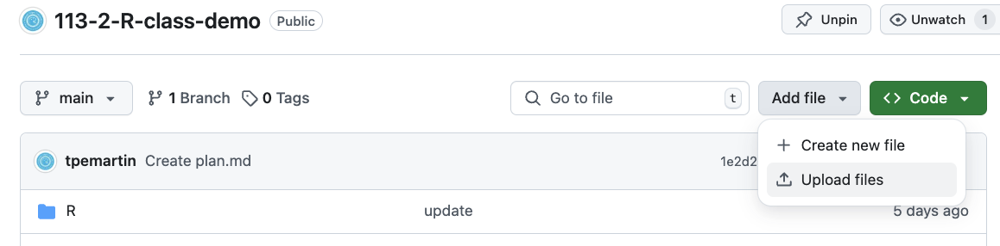
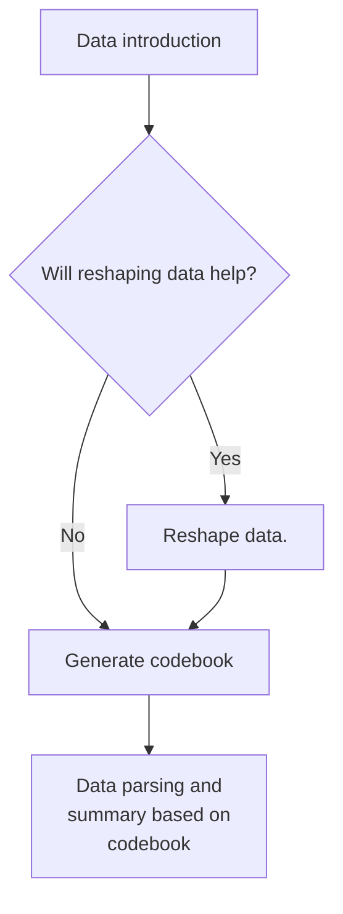

# Talk to Data via AI

Let AI see your data and introduce it to you.

  - Data introduction  
  - Storytelling with data  

> Download a data from [data.gov.tw](https://data.gov.tw/).

## Choice of AI

  - Upload to ChatGPT  
  - Upload to Github

|  |  |
|------------------------------------------------------------|------------------------------------------------------------|

## Preliminary Data Tidy Process

[歷年中華民國國民出國目的地人數統計](https://data.gov.tw/dataset/7325)

### Data introduction

Key components:
  - What is the dataset about?  
  - What are the variables?
  - What are the variable types?  

### Reshape data

Sometimes **reshape** you data will make further exploration easier.

### Generate codebook

A codebook is a document that describes the contents, structure, and layout of a data collection. It contains the information of the key components of the dataset.

### Data Parsing and Summary

Use codebook as a reference to parse data.

## 練習

自[政府資料開放平台](https://data.gov.tw) 下載一個資料集，並完成上述流程。