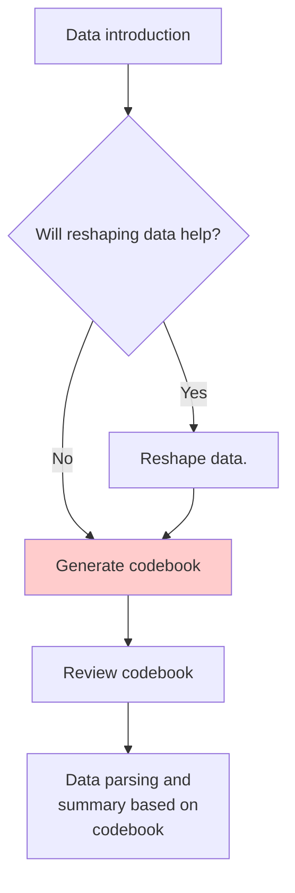

# Codebook

With proper codebook that describes variables, types, and meanings, we can better understand the dataset so can AI.

  - Have AI generate a codebook with Markdown table syntax.  
  - Confirm variable classes. 
  - Import the data and parse variables according to the codebook.  

[歷年中華民國國民出國目的地人數統計 reshaped](https://github.com/tpemartin/113-2-econDV-demo/blob/main/travel-destination/reshape/reshaped_travel_data/reshaped_travel_data.csv)

## Generate codebook

Key elements:  

  - A table of variable names, classes, and meanings (give some example if possible).
  - A brief description of the dataset.

## Review codebook

Review codebook (especially variable classes) before importing the data.

## Parsing data

