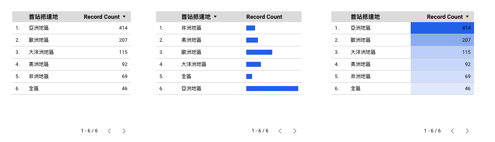

# Table

 

## Pros and Cons of Tables

Pros:
- Easy to read
- Easy to compare data
- Easy to understand

Cons:
- Can be difficult to read if there are too many columns
- Can be difficult to read if there are too many rows
- Can be difficult to read if there are too many cells

## Table in Text

  - Table in Markdown syntax  
  - Convert Markdown to Word or PDF

## Table in Looker

  - Table in Looker
  - Share Looker report with others

