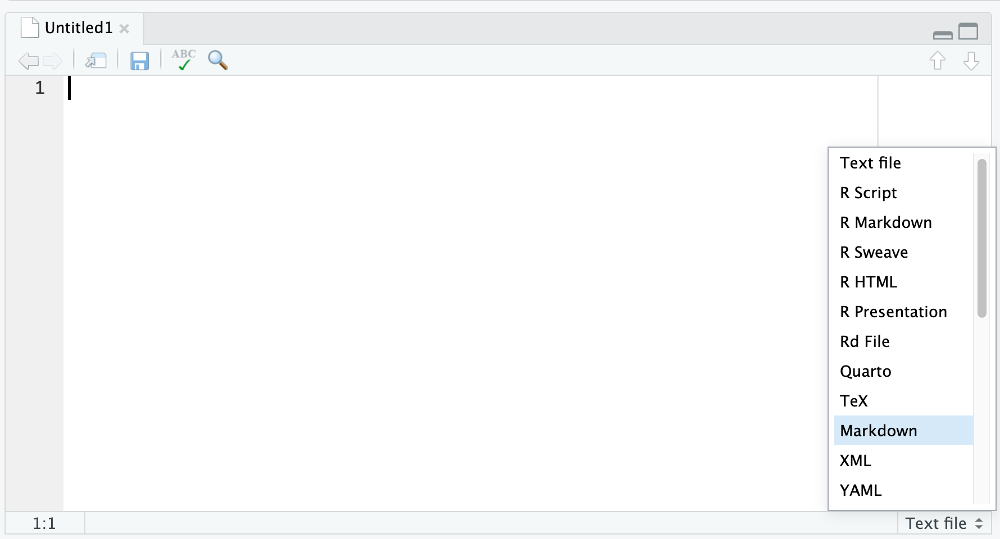

# Markdown 

A syntax for formatting text as a text file.

|  |  |
|--------------------------------------|--------------------------------------|

## 練習

> Create some content using Markdown syntax. The content should include:
> - A heading
> - A list
> - A table
> - A code block

## Source and Visual Mode in POSIT

|  |  |
|--------------------------------------|--------------------------------------|

## Preview, Code, and Blame Mode in Github

