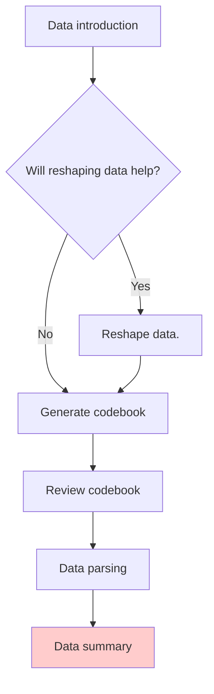

# Summary Table: single variable

  - Summarize single (multiple) variable(s)
  - Storage or summary information
  - Interpretation of summary information

 

[歷年中華民國國民出國目的地人數統計 reshaped](https://github.com/tpemartin/113-2-econDV-demo/blob/main/travel-destination/reshape/reshaped_travel_data/reshaped_travel_data.csv)

## Summarize single variable

Different class of variables require different ways of summarization. The following is some suggestions:  

| Variable Class        | Summary Statistics                                |
| --------------------- | ------------------------------------------------- |
| Numeric               | Mean, Median, Standard Deviation, Max, Min, Range |
| Factor/Ordered Factor | Frequency Table                                   |
| Character             | Unique Values, Count                              |
| Date                  | Min, Max, Range                                   |
| Date/Time             | Min, Max, Range, Time Interval                    |
| Logical               | Frequency Table                                   |

> Also NA proportion is important to know.

### Prompt

  - Predicate: task body, including the instruction, context, input data, and/or output.  
  - Meta prompt: Guidance on AI persona, and the user's role.  
  - Hyperparameters: parameters that control the behavior of the model. 

***

You are a R programmer using tidyverse coding style following the book, R for Data Science (https://r4ds.had.co.nz/) closely. 

Summarize each variable in the data frame `reshape_travel_data` whose variables and their classes are ....

The summary for each variable should follow the rules: ....

The results should be saved in a list.

## Storage of summary information

  - Savd as R readable, `.Rds`.  
  - Export to Google Sheets for data frames.  

### Save as .Rds

### Export to Google Sheets

  - Create a new Google Sheet, get its link.  
  - Export relevant data frame to the Google Sheet using `googlesheets4` package.

## Interpretation of summary information

