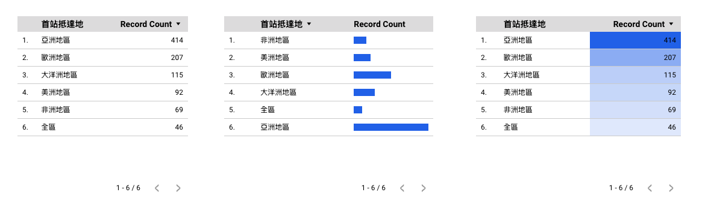
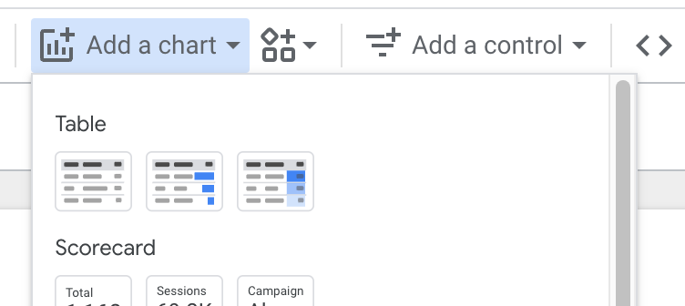

# Table

 

## Pros and Cons of Tables

Pros:
- Easy to read
- Easy to compare data
- Easy to understand

Cons:
- Can be difficult to read if there are too many columns
- Can be difficult to read if there are too many rows
- Can be difficult to read if there are too many cells

## Tabe and data frame summary

A lot of time table is a **summary** of data frame.

### Example

Based on `reshaped_travel_data`, 
Here are some summaries you might be interested in performing on the `reshaped_travel_data`, presented in Markdown format:

### Summaries for `reshaped_travel_data`

- **Traveler Demographics**
  - Different variable `細分` 's total travelers across years 

<https://github.com/tpemartin/113-2-econDV-demo/blob/c1a305a53d95a42d9ceaf57f328643d6c57b9487/travel-destination/reshape/reshaped_travel_data/parsing_summary/summary_table.R#L1-L10>

### Markdown table

You can always convert R data frame to markdown table.

## Table in Looker Studio

  [Connecting data in Looker Studio](lookerstudio-connect-data.md)

### Dimension and Metrics in Looker

  - **Dimensions**: a field/fields that is/are used to group data
  - **Metric**: a field that is used to calculate data

