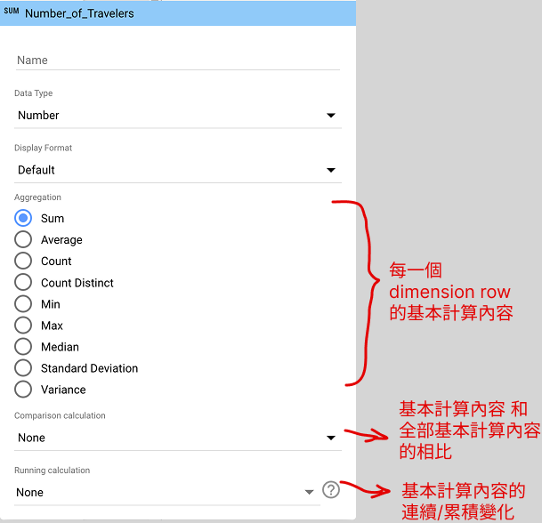
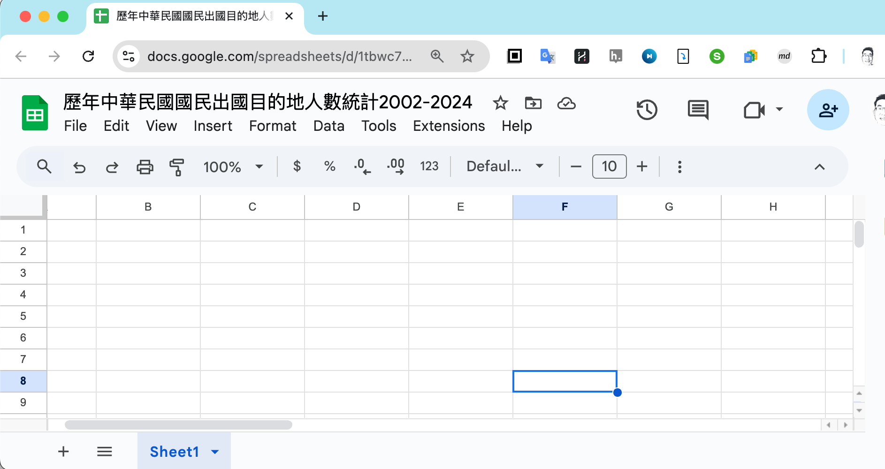

# Summary Table: multiple variables

## Table in Looker Studio

  [Connecting data in Looker Studio](lookerstudio-connect-data.md)

Make a copy of the following dashboard:
[歷年中華民國國民出國目的地人數統計2002-2024 dashboard](https://lookerstudio.google.com/reporting/c0b8fea5-3335-4713-8b01-ed45cbf8f392)

### Dimension and Metrics in Looker

  - **Dimensions**: a field/fields that is/are used to group data
  - **Metric**: a field that is used to calculate data

> Dimensions呈現有多少可能的組別，Metrics 則是對這些組別進行某些field特徵計算。

> slido: 把能呈現不同首站抵達地的旅客人數佔比的表格metric設定截圖貼上來。

### Dimension and Metrics in R

  - **group by**: dimensions  
  - **summarise**: metrics

> 你可以把Looker Studio的設定，當成prompt predicate 的context來請求R程式碼。

### Summary table to Google sheets

  - A data frame in R can always be exported to a Google sheets.  
  - Google sheets is easy for table editing and sharing.  
    - [Generate Markdown Table extension](https://workspace.google.com/marketplace/app/generatemarkdowntable/23306117760)

  - Spreadsheet link/shared link  
  - Sheet
