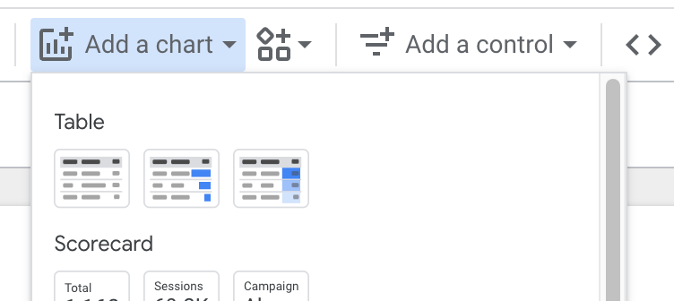

# Summary Table: multiple variables

## Table in Looker Studio

  [Connecting data in Looker Studio](lookerstudio-connect-data.md)

Make a copy of the following dashboard:
[歷年中華民國國民出國目的地人數統計2002-2024 dashboard](https://lookerstudio.google.com/reporting/c0b8fea5-3335-4713-8b01-ed45cbf8f392)

### Dimension and Metrics in Looker

  - **Dimensions**: a field/fields that is/are used to group data
  - **Metric**: a field that is used to calculate data

> Dimensions呈現有多少可能的組別，Metrics 則是對這些組別進行某些field特徵計算。

### Dimension and Metrics in R

  - **group by**: dimensions  
  - **summarise**: metrics
