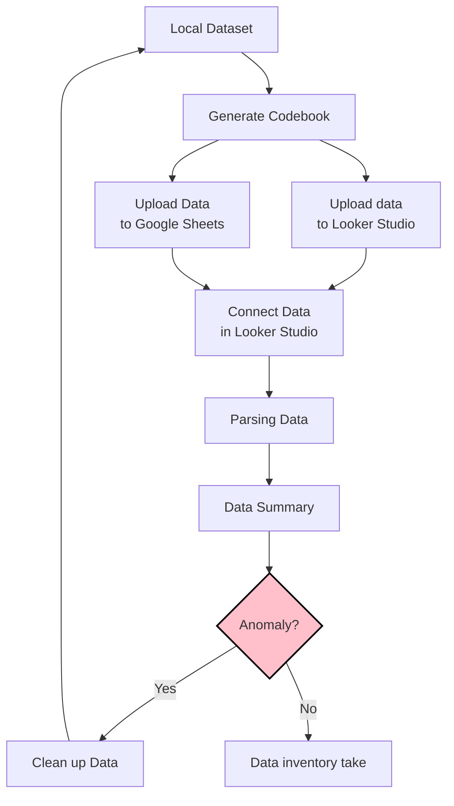

# Tidy Data

## Data pipeline

  - In each arrow step, you choose to do it manually or through programming code.

## Clean up variables

https://github.com/tpemartin/113-2-econDV-demo/blob/881077f558613c4ceecfceef797be13d1fa9c7b5/travel-destination/reshape/reshaped_travel_data/codebook-reshaped_travel_data.md?plain=1#L29-L31

https://github.com/tpemartin/113-2-econDV-demo/blob/881077f558613c4ceecfceef797be13d1fa9c7b5/travel-destination/reshape/reshaped_travel_data/codebook-reshaped_travel_data.md?plain=1#L37-L66

## Upload data to Google Sheets

### Another way to connect data

  - [Connecting data in Looker Studio](lookerstudio-connect-data.md)

## Data Inventory take

