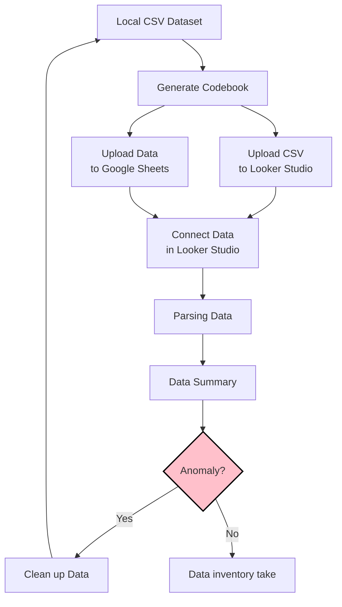

# Tidy Data

## Data pipeline

  - In each arrow step, you choose to do it manually or through programming code.

## Upload Data to Google Sheets

  - Upload `reshaped_travel_data.csv` to Google Sheets as `reshaped_travel_data` sheet.

## Connect data to Looker Studio

  - [Connecting data in Looker Studio](lookerstudio-connect-data.md)

## Parsing data

## Data summary

<iframe width="600" height="450" src="https://lookerstudio.google.com/embed/reporting/c0b8fea5-3335-4713-8b01-ed45cbf8f392/page/ixdCF" frameborder="0" style="border:0" allowfullscreen sandbox="allow-storage-access-by-user-activation allow-scripts allow-same-origin allow-popups allow-popups-to-escape-sandbox"></iframe>

## Clean up variables

Factor levels should be:  
  - 互斥 (mutually exclusive)
  - 完整 (exhaustive)

https://github.com/tpemartin/113-2-econDV-demo/blob/881077f558613c4ceecfceef797be13d1fa9c7b5/travel-destination/reshape/reshaped_travel_data/codebook-reshaped_travel_data.md?plain=1#L29-L31

https://github.com/tpemartin/113-2-econDV-demo/blob/881077f558613c4ceecfceef797be13d1fa9c7b5/travel-destination/reshape/reshaped_travel_data/codebook-reshaped_travel_data.md?plain=1#L37-L66

  資料移除：  
    - `首站抵達地` 是 "全區"，或 
    - `細分` 中出現"合計"或"總計"字眼

> slide:   寫下你的prompt, 能夠完成資料移除任務，並存成csv檔案。

## Upload data to Google Sheets (again)

  - after clean up

<iframe width="600" height="450" src="https://lookerstudio.google.com/embed/reporting/ecd2cf06-3ada-4aeb-876f-915ddc0a8d43/page/PcYEF" frameborder="0" style="border:0" allowfullscreen sandbox="allow-storage-access-by-user-activation allow-scripts allow-same-origin allow-popups allow-popups-to-escape-sandbox"></iframe>

