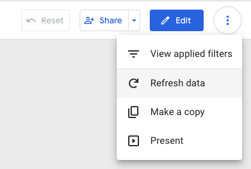

# Tidy Data

## Data pipeline

  - In each arrow step, you choose to do it manually or through programming code.

## Upload Data to Google Sheets

先開一個Google sheets。

  - Upload `reshaped_travel_data.csv` to Google Sheets as `reshaped_travel_data` sheet.

> slido: 請貼上可以把`reshaped_travel_data`由R上傳到Google Sheets的程式碼。

## Connect data to Looker Studio

  - [Connecting data in Looker Studio](lookerstudio-connect-data.md)

## Parsing data

## Data summary

## Clean up variables

Factor levels should be:  
  - 互斥 (mutually exclusive)
  - 完整 (exhaustive)

https://github.com/tpemartin/113-2-econDV-demo/blob/881077f558613c4ceecfceef797be13d1fa9c7b5/travel-destination/reshape/reshaped_travel_data/codebook-reshaped_travel_data.md?plain=1#L29-L31

https://github.com/tpemartin/113-2-econDV-demo/blob/881077f558613c4ceecfceef797be13d1fa9c7b5/travel-destination/reshape/reshaped_travel_data/codebook-reshaped_travel_data.md?plain=1#L37-L66

  資料移除：  
    - `首站抵達地` 是 "全區"，或 
    - `細分` 中出現"合計"或"總計"字眼

> slide: 寫下你的prompt, 任務是得到能夠完成以下任務的程式：資料移除任務，並存成csv檔案同時上傳更新到Google Sheets。

## Upload data to Google Sheets (again)

  - Google Sheets更新後，與之連結的Looker Studio的資料也會更新(內訂15分鐘更新一次)；或

## Data inventory taking

  - 最終版的分析資料
  - 資料codebook  
  - 其他資料相關訊息

<https://classroom.google.com/c/Njg4NjgzMjEyOTI4/m/NzU5NzE4NDA5MzAw/details>