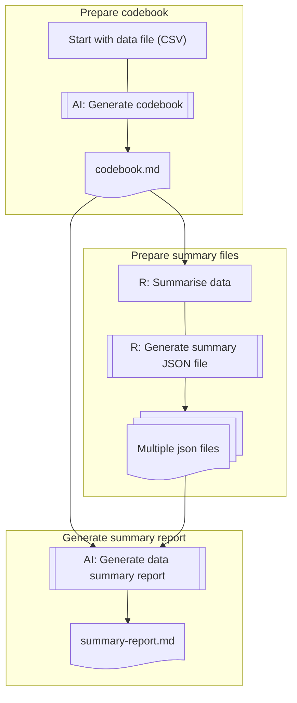

# Data Summary with AI

When data is tidied up and ready for analysis, we can use AI to help us summarise the data. 

  - What to summarise? 
  - Summary report
  
## What to summarise

If AI knows **the data variable structure** (codebook), it can help/suggest us to summarise the data with programming code suggestion.

## Summary report

If AI can **read the summary statistics**, it can help us to generate a summary report.

## Flowchart



> :exclamation: When ask AI always use upstream documents as part of predicate context/input of data.

## Example

[Appendix: Data Summary Prompts Example](Appendix-data-summary-complete-prompt-example.md)

  - ChatGPT: <https://chatgpt.com/share/67fdc1bd-c254-8006-a36f-8e31a1e660c8>

File structure under [`datasets/travel-destination/`](../datasets/travel-destination/):

```
datasets/travel-destination/
├── data-summary-report.docx
├── data-summary-report.Rmd
├── import-parsing-summary.R
├── summaries/
│   ├── single-variable-summary.json
│   ├── yearly-total-by-region.json
│   ├── top5-avg-destinations.json
│   ├── missing-summary.json
├── codebook.md
```


