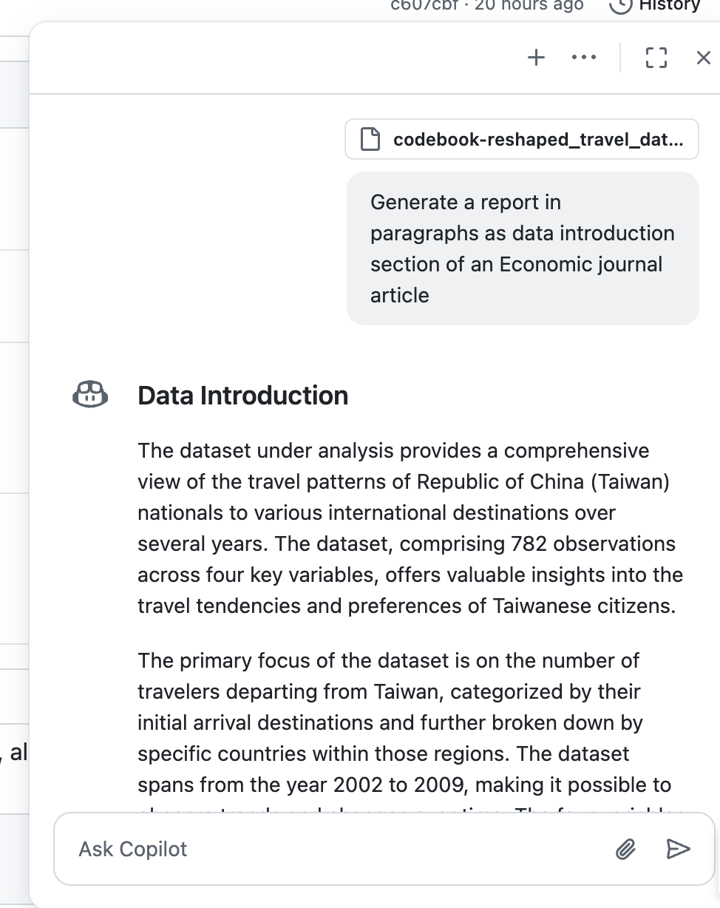
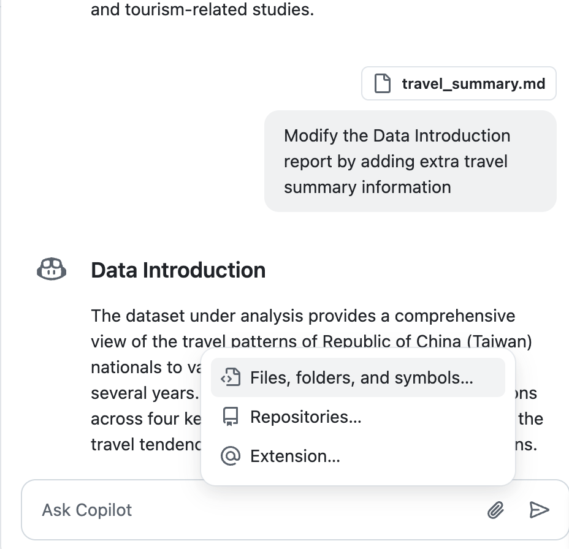

# Data Summary with AI

  - Create summary tables
  - Generate table notes in Markdown
  - Ask AI to summarise the data observations
  - Refine Data summary

## Create summary tables

Use `group_by` and `summarise` to create summary tables.

## Generate table notes in Markdown

### Use `knitr::kable()`

### Upload to Google Sheets

  - Google sheets is easy for table editing and sharing.  
    - [Generate Markdown Table extension](https://workspace.google.com/marketplace/app/generatemarkdowntable/23306117760)

## Ask AI to summarise the data observations

> Generate a report in paragraphs as data introduction section of an Economic journal article

***

You can attach more files to enrich the data introduction report.

***

[Data introduction](https://github.com/tpemartin/113-2-econDV-demo/blob/main/travel-destination/articles/data-introduction.md)

