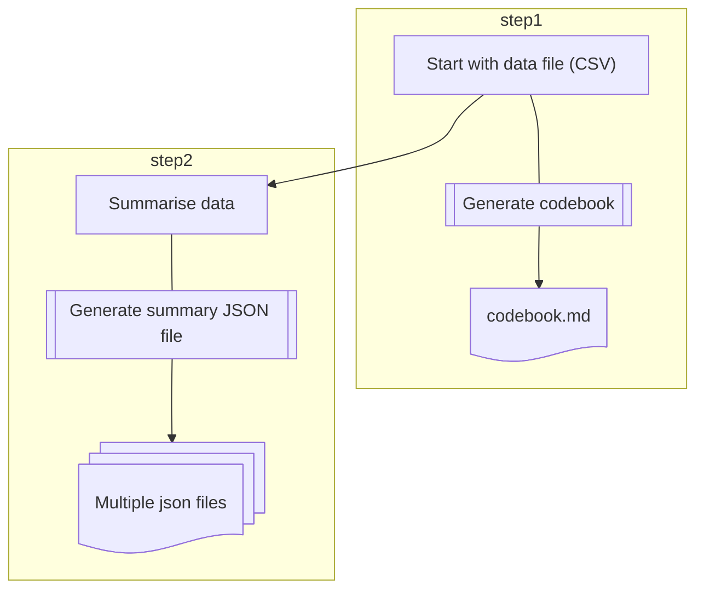
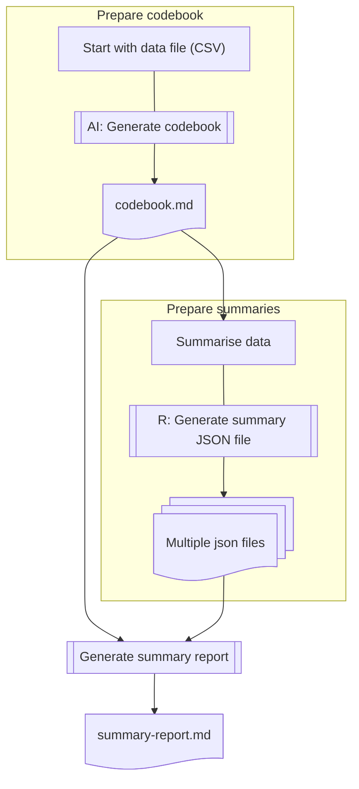

# Data Summary with AI

When data is tidied up and ready for analysis, we can use AI to help us summarise the data. 

  - What to summarise? 
  - Summary report
  
## What to summarise

If AI knows **the data variable structure** (codebook), it can help/suggest us to summarise the data with programming code suggestion.

## Summary report

If AI can **read the summary statistics**, it can help us to generate a summary report.

### Flowchart






## Summary report with AI

### Information structure

Consider the following file structure:

```
/data
  - data csv file
  - codebook.md (text)

/data/summaries/
  - data-summary1.json (text)
  - data-summary2.json (text)
  - ... .
```

> We are going to ask AI to generate a data report based on that text files. (why text?)

## Formulate predicates

  - Instruction  
  - Context/Input data: codebook and other text information  
  - Output: Markdown table or JSON (for complex infromation structure)

> :exclamation: Output in text format can be reused as AI predicate context or input of data later


## JSON output

The output should be a stringfy JSON object as the following:

```json
{
  "description": <string>,
  "summary": <Object of summary result>
}
```

> Can use it as a context, and setup at the very beginning of a AI chat
>
> Saved under /summaries as a .json file

## Work with AI 

Think about instruction and context/input of data


  - Start with single variable summary. Ask AI what to summarise for single variables (context: codebook of variable information). 
  - Enrich codebook to contain single variable summary information.
  - Ask AI to suggest multiple variable summary ideas (context: complete codebook)  
  - Ask AI to generate 

## Bear in mind

> :exclamation: Information to be summarised should be in text format

  - paragraphs, 
  - itemized lists, 
  - (markdown) tables, or
  - JSON (for complicated information structure)


## Create summary tables

Use `group_by` and `summarise` to create summary tables.


## Generate table notes in Markdown

### Use `knitr::kable()`

### Upload to Google Sheets

  - Google sheets is easy for table editing and sharing.  
    - [Generate Markdown Table extension](https://workspace.google.com/marketplace/app/generatemarkdowntable/23306117760)

## Ask AI to summarise the data observations

> Generate a report in paragraphs as data introduction section of an Economic journal article


***

You can attach more files to enrich the data introduction report.


***

[Data introduction](https://github.com/tpemartin/113-2-econDV-demo/blob/main/travel-destination/articles/data-introduction.md)

