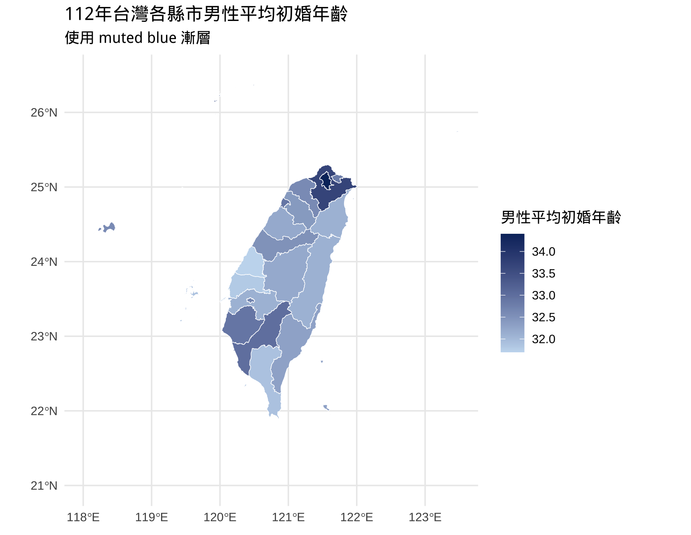

# 📘 教學講義：Simple Feature 與自動產生 Codebook（JSON）




## 🧭 1. Simple Feature 是什麼？

`Simple Feature`（簡稱 `sf`）是地理空間資料在 R 語言中常用的資料框類型。每一筆資料可以包含一個幾何圖形（如點、線、多邊形），並與其他屬性資料（欄位）整合成一個資料框。

其特徵包括：
- 一個data frame 結構
- data frame有一個geometry欄位儲存 `POINT`、`POLYGON` 等空間圖形物件
- CRS(座標參考系）
- Bounding Box（邊界框）

---

## 📂 2. 資料格式

### SHP 格式

  - [直轄市、縣市界線(TWD97經緯度)](https://data.gov.tw/dataset/7442)

> 開放資料平台可篩選檔案格式shp會列出更多地理資料

### GeoJSON 格式

  - [台北捷運路線](https://data.gov.tw/dataset/121208)

## 3. 準備import script

> 跟ChatGPT說你的資料在POSIT Cloud的路徑，問它怎麼import成 `sf` 物件。

---

## 🔍 4. codebook製作


```r
print(sf object)
```

將它的meta及data frame的前幾行copy paste 給AI請它幫你製作codebook。


---

## 📊 5. 繪圖

一旦AI 知道你有一個simple feature物件，它就會知道你要用`geom_sf()`來繪圖。

## 示範：

  - shp: <https://chatgpt.com/share/6835286d-4cb8-8006-8684-c0eb617b0242>
  - json: <https://chatgpt.com/share/683548a7-00bc-8006-891d-c5a0788a7705>

## 練習

使用以下資料產生codebook及import script：

  - [自行車道](https://data.gov.tw/dataset/41652)