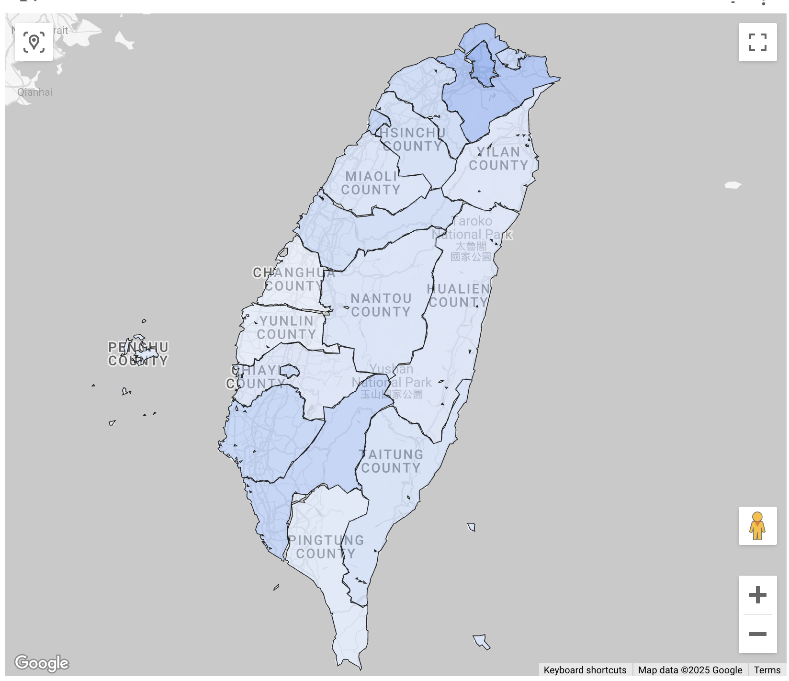

# Choropleth map

## R

  - 生成初婚資料codebook <https://chatgpt.com/share/682bfc91-1c68-8006-97b7-b7c115af1e90>
  - 與simple feature結合 <https://chatgpt.com/share/682bfcdd-fbf4-8006-9052-7a14f9b1c6e9>

:exclamation: **請注意** `join`的主資料集必須是`sf`物件，否則合併後的data frame會失去`sf`的屬性而無法使用`geom_sf()`繪圖。

## Looker Studio

  - field type: GEO
  - color metric vs. color dimension  
  - filter