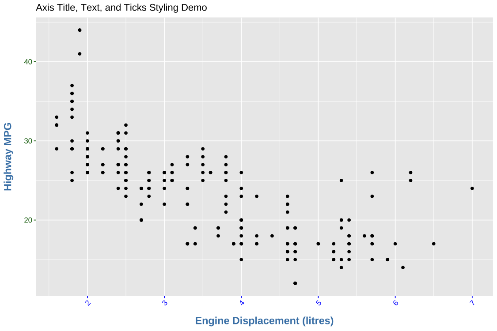
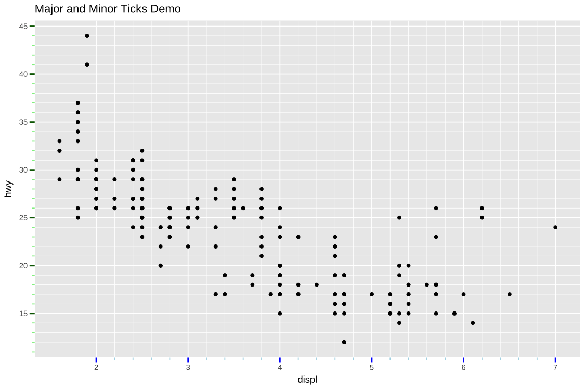
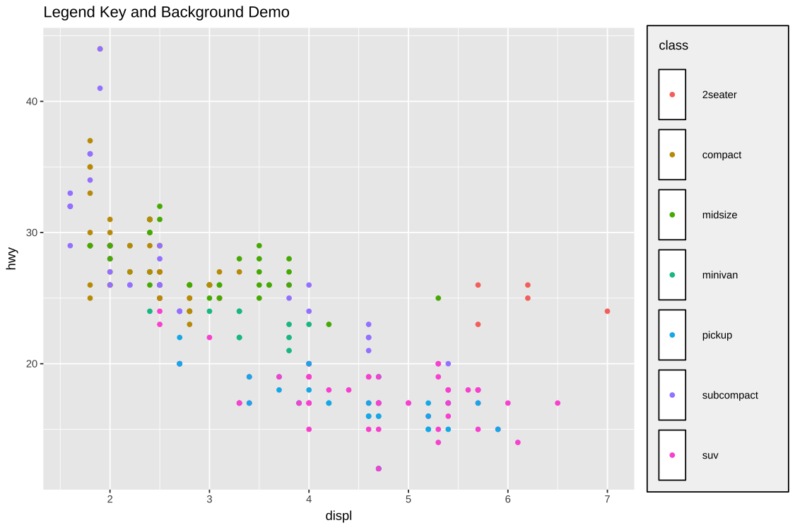
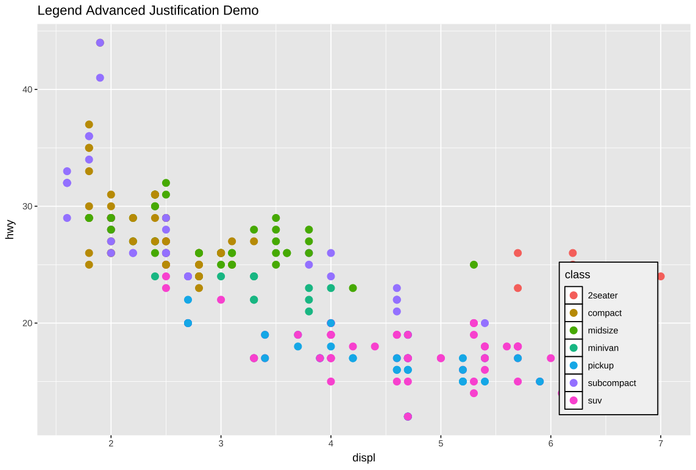
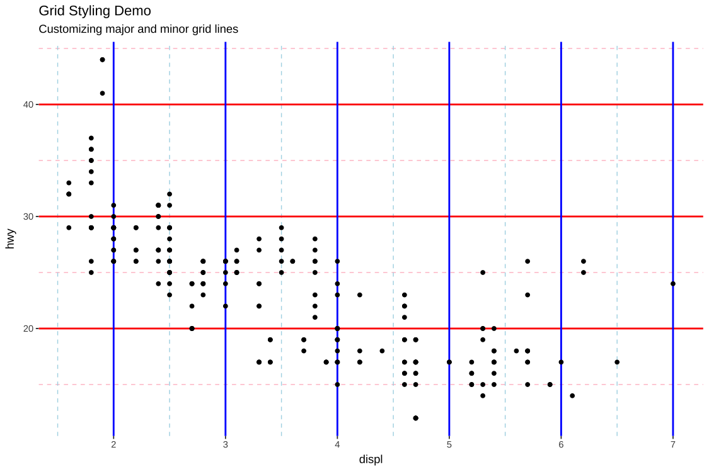

# 🎨 Understanding `theme()` Elements in ggplot2

The `theme()` function in `ggplot2` customizes the non-data components of a plot, such as text, lines, margins, and backgrounds. Below is a categorized outline of the major theme elements you can modify.

---

## 1. 🌐 Global Theme Settings
- `complete`: Replace existing theme elements.
- `validate`: Check for valid theme elements.

---

## 2. 🧱 Basic Element Definitions
- `line`: Default line properties.
- `rect`: Default rectangle (background) properties.
- `text`: Default text appearance.
- `title`: General title text appearance.
- `aspect.ratio`: Control panel aspect ratio.

---

## 3. 📏 Axis Customization

[](../R/labs.R)

### 3.1 Axis Titles
- `axis.title`
- `axis.title.x`, `axis.title.y`
- `axis.title.x.top`, `axis.title.x.bottom`
- `axis.title.y.left`, `axis.title.y.right`

### 3.2 Axis Tick Labels
- `axis.text`
- `axis.text.x`, `axis.text.y`
- `axis.text.x.top`, `axis.text.x.bottom`
- `axis.text.y.left`, `axis.text.y.right`
- Polar plots: `axis.text.theta`, `axis.text.r`

### 3.3 Axis Tick Marks
- Major:
  - `axis.ticks`, `axis.ticks.x`, `axis.ticks.y`
  - `axis.ticks.x.top`, `axis.ticks.x.bottom`
  - `axis.ticks.y.left`, `axis.ticks.y.right`
  - Polar: `axis.ticks.theta`, `axis.ticks.r`
- Minor:
  - `axis.minor.ticks.x.top`, `axis.minor.ticks.y.right`, etc.

:exclamation: To use minor ticks, you need to set the `guide` argument in the scale function. For example:
```
  scale_x_continuous(
    ...,
    guide=guide_axis(minor.ticks = TRUE)
  ) 
```

---

[](../R/axis-mm-ticks.R)

---


### 3.4 Tick Lengths
- Major tick lengths:
  - `axis.ticks.length`, `axis.ticks.length.x`, `axis.ticks.length.y`
  - Subvariants: `.top`, `.bottom`, `.left`, `.right`
- Minor tick lengths:
  - `axis.minor.ticks.length`, `axis.minor.ticks.length.x.top`, etc.

### 3.5 Axis Lines
- `axis.line`, `axis.line.x`, `axis.line.y`
- Subcomponents:
  - `.top`, `.bottom`, `.left`, `.right`
- Polar plots: `axis.line.theta`, `axis.line.r`

---

## 4. 🧭 Legend Customization

### 4.1 Layout
- `legend.position`, `legend.direction`
- `legend.byrow`, `legend.justification`, `legend.location`

### 4.2 Title and Text
- `legend.title`, `legend.title.position`
- `legend.text`, `legend.text.position`

### 4.3 Key and Background
- `legend.background`, `legend.margin`, `legend.spacing`
- `legend.key`, `legend.key.size`
- `legend.key.height`, `legend.key.width`
- `legend.key.spacing`, `legend.key.spacing.x`, `legend.key.spacing.y`
- `legend.frame`, `legend.ticks`, `legend.ticks.length`
- `legend.axis.line`

---

[](../R/legend-keys.R)

---

### 4.4 Advanced Justification
- `legend.justification.top`, `.bottom`, `.left`, `.right`, `.inside`
- `legend.position.inside`

---

[](../R/legend-advance.R)

---

### 4.5 Legend Box Control
- `legend.box`, `legend.box.just`
- `legend.box.margin`, `legend.box.background`, `legend.box.spacing`

---

## 5. 📦 Panel and Grid Styling
- `panel.background`, `panel.border`
- `panel.spacing`, `panel.spacing.x`, `panel.spacing.y`
- Grid lines:
  - `panel.grid`, `panel.grid.major`, `panel.grid.minor`
  - Subcomponents: `.major.x`, `.major.y`, `.minor.x`, `.minor.y`
- `panel.ontop`: Bring grid above plot layer

---

[](../R/theme-grid.R)

---

## 6. 🖼️ Plot-Level Decorations
- `plot.background`
- `plot.title`, `plot.subtitle`, `plot.caption`, `plot.tag`
- Positions:
  - `plot.title.position`, `plot.caption.position`
  - `plot.tag.position`, `plot.tag.location`
- `plot.margin`

---

## 7. 🧩 Facet Strip Customization

### 7.1 Background and Text
- `strip.background`, `strip.background.x`, `strip.background.y`
- `strip.text`, `strip.text.x`, `strip.text.y`
- Subcomponents:
  - `strip.text.x.top`, `strip.text.x.bottom`
  - `strip.text.y.left`, `strip.text.y.right`

### 7.2 Layout and Placement
- `strip.clip`, `strip.placement`
- `strip.switch.pad.grid`, `strip.switch.pad.wrap`

---

## 🧠 Notes
- Use `theme()` together with `element_*()` (e.g. `element_text()`, `element_line()`, `element_blank()`) to customize each component.
- For global changes, combine with `theme_set()` or replace defaults using `theme_replace()`.

