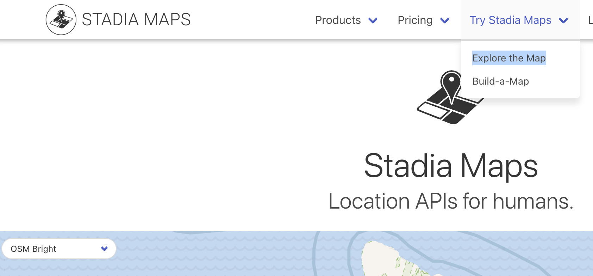

# Base map

## Example:

交付codebook給AI
<https://chatgpt.com/share/683e65f3-10c4-8006-b0cf-e341e277ebe0>

與AI討論圖形
<https://chatgpt.com/share/683e66bc-9b74-8006-a9cf-7f18eaa9d8be>

完整程式碼
```r

# Assuming `taiwan_sf` and `taipei_mrt` are already loaded in the global environment

# Official Taipei MRT route colors
mrt_colors <- tibble::tribble(
  ~RouteName, ~color,
  "淡水線",   "#E3002C",  # Red
  "新店線",   "#007749",  # Green
  "中和線",   "#F8B500",  # Orange
  "板橋線",   "#0072C6",  # Blue
  "蘆洲線",   "#F8B500",  # Orange (same as 中和線)
  "新莊線",   "#F8B500",  # Orange (same as 中和線)
  "小南門線", "#007749",  # Green (same as 新店線)
  "松山線",   "#007749",  # Green
  "南港線",   "#0072C6",  # Blue
  "信義線",   "#E3002C",  # Red (same as 淡水線)
  "木柵線",   "#AD7D39",  # Brown
  "內湖線",   "#AD7D39",  # Brown (same as 木柵線)
  "碧潭支線", "#007749",  # Green (same as 新店線)
  "環狀線",   "#FBBF00"   # Yellow
)

# Join colors with mrt data
taipei_mrt_colored <- taipei_mrt |>
  dplyr::left_join(mrt_colors, by = "RouteName")

# Plot
library(ggplot2)

# Filter taiwan_sf for Greater Taipei Area
taipei_sf <- taiwan_sf |>
  dplyr::filter(COUNTYNAME %in% c("臺北市", "新北市"))

# Define the bounding box filter
bbox_xlim <- c(121.31, 121.7)  # longitude range (E)
bbox_ylim <- c(24.9, 25.2)    # latitude range (N)


# Filter only Taipei City boundary
taipei_city_sf <- taipei_sf |>
  dplyr::filter(COUNTYNAME == "臺北市")

# Plot: Only Taipei City boundary + MRT lines
ggplot() +
  geom_sf(data = taipei_city_sf, fill = "white", color = "gray50", linewidth = 0.5) +
  geom_sf(data = taipei_mrt_colored, aes(color = color), linewidth = 1.2, show.legend = FALSE) +
  scale_color_identity() +
  coord_sf(
    xlim = c(121.4, 121.7),
    ylim = c(24.9, 25.2)
  ) +
  theme_minimal(base_family = "Noto Sans TC") +
  theme(
    panel.background = element_rect(fill = "white"),
    panel.grid = element_blank()
  )
```

## Stadia maps

<https://stadiamaps.com/>



  - Use Explorer to find the map you want.
  - Choose your theme.
  

<https://chatgpt.com/share/683e6d05-5e8c-8006-94a5-935d2c93bc36>

  - 留意底圖與simple feature的CRS（座標參考系）是否一致。


## Bounding Box problem

```r
remotes::install_github("tpemartin/ntpudatavis")
```


修正bounding box問題：
```r
ggmap(taipei_basemap |>
        ntpudatavis::ggmap_bbox()) +
```