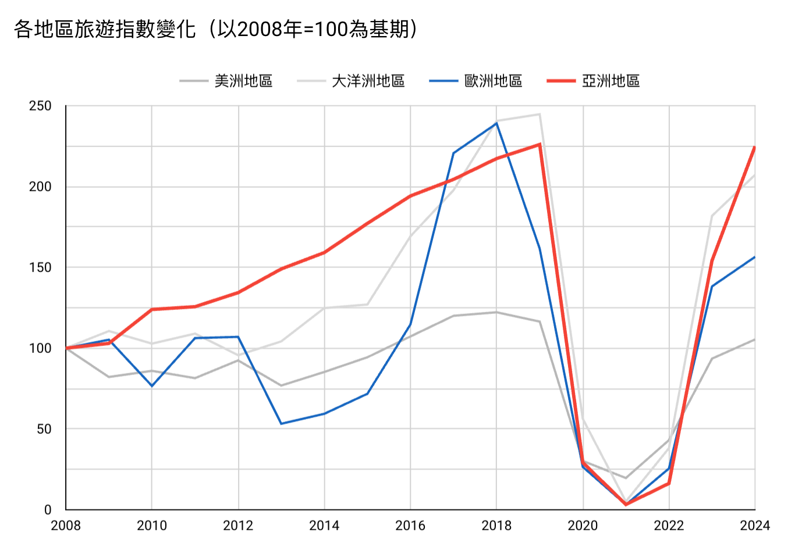
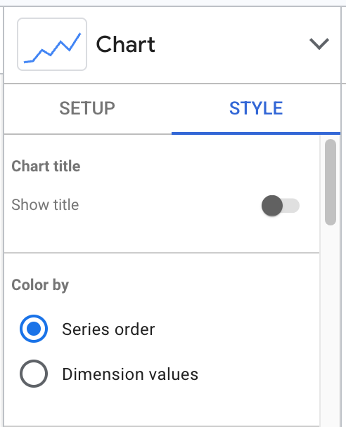

# Appendix: Looker Studio Layer Order



  - [連結](https://lookerstudio.google.com/reporting/ecd2cf06-3ada-4aeb-876f-915ddc0a8d43)
  - [資料](https://docs.google.com/spreadsheets/d/1tceOB6JbwhQuYXAy6mtwszHabGE6BUG7rxiHa_5Y_6c/edit?gid=115389518#gid=115389518)

---

:exclamation: 創造一個可以代表你想要的順序的Calculated Field

You want to **customize the line order manually** to:

1. 亞洲地區 (Asia)
2. 歐洲地區 (Europe)
3. Others

Here's how to do it:

---

### ✅ **Step-by-step workaround using a custom numeric sort field**

1. **Go to the Data section** (right panel in your screenshot).
2. Click **"Add a field"**.
3. Name the new field something like `region_order`.
4. Use this formula:

```text
CASE
  WHEN region = "亞洲地區" THEN 1
  WHEN region = "歐洲地區" THEN 2
  WHEN region = "大洋洲地區" THEN 3
  WHEN region = "美洲地區" THEN 4
  ELSE 5
END
```

5. Click **Save**.

---

### 🔁 Then update chart settings

1. In your chart settings under `Breakdown Dimension Sort`, select the new field `region_order`.
2. Make sure **"Ascending"** is selected so the lines are layered top to bottom by:

   * 亞洲地區 (top)
   * 歐洲地區
   * 大洋洲地區
   * 美洲地區 (bottom)

---

### 📊 Update Color



  1. Color by **Series order**.  
  2. Adjust series colors one by one to match your desired color scheme.

***

You can ask AI with your screen shot uploaded.


