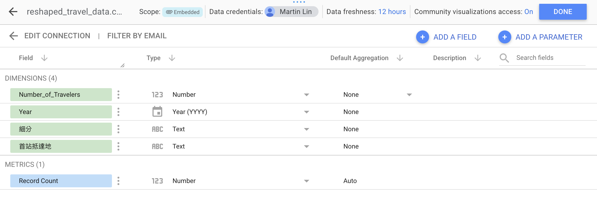

# Looker Studio

## Add data

## Parse fields

  - **fields**: same as varialbes in a data frame.
  - pasing: set the **types** of fields.

Resource > Manage added data sources

choose the data source, then click "Edit"

